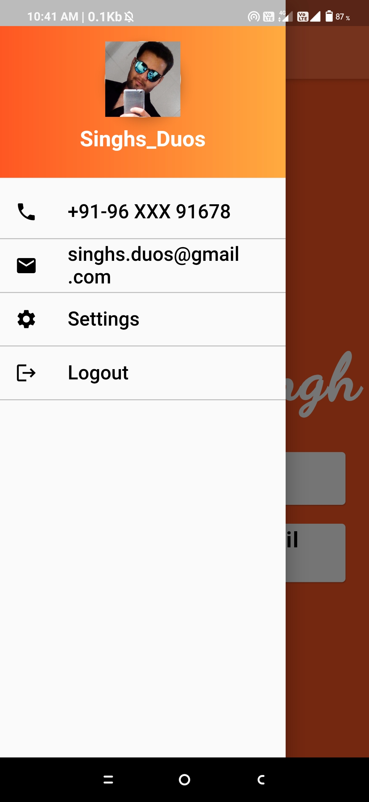

# Profile App
 In this I created 2 pages
## HomePage  

## Drawer  

This is the very basic and easiest app for students to sart with flutter development.

## Getting Started

This project is a starting point for a Flutter application.

A few resources to get you started if this is your first Flutter project:

- [Lab: Write your first Flutter app](https://flutter.dev/docs/get-started/codelab)
- [Cookbook: Useful Flutter samples](https://flutter.dev/docs/cookbook)

For help getting started with Flutter, view our
[online documentation](https://flutter.dev/docs), which offers tutorials,
samples, guidance on mobile development, and a full API reference.

## Tools Required
VS code with flutter sdk and also with flutter and dart extension.
Android Studio with android sdk.

## Important suggestion
* If your laptop ram less than 4gb then instead of installing android emulator in android studio you can go with physical device(Your Mobile)
* And more you can read flutter doc by clicking above link.

## Thank You!

