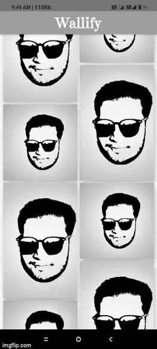

**NOTE FROM AUTHOR**

In this repository there is 3 project : 
1. CrudApp (Implementation of Google and Firebase Authentication)
2. Wallify (Here I used FireBase as Backend to store update and delete images from backend using firebase and it will reflect on users phone)
3. ML-Kit (Imlementation of dependencies of ml given by flutter for Text,BarCode,Label and Face Detector)

**/NOTE FROM AUTHOR**

# Wallify
And This is my main project in this repository.

A Flutter project with implementation of all firebase libraries for Android and iOS both.

### Screenshots of above all Projects

 
 

### NOTE

- This project is still under development.

## Getting Started

This project is a starting point for a Flutter application.

A few resources to get you started if this is your first Flutter project:

- [Lab: Write your first Flutter app](https://flutter.dev/docs/get-started/codelab)
- [Cookbook: Useful Flutter samples](https://flutter.dev/docs/cookbook)

For help getting started with Flutter, view our
[online documentation](https://flutter.dev/docs), which offers tutorials,
samples, guidance on mobile development, and a full API reference.
